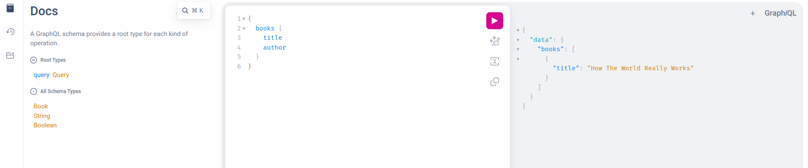

<!-- PROJECT LOGO -->
<br />
<div align="center">

  <h3 align="center">Very Simple GraphQL Server</h3>


</div>


<!-- ABOUT -->
## About



This project demonstrates a simple GraphQL API using the Strawberry library in Python.


## Getting Started

### 1. Install Dependencies

```bash
> python3 -m venv venv

> source venv/bin/activate

> pip install -r requirements.txt
```

### 2. Run the Server

```bash
> strawberry server schema
```

This will start a GraphQL server on your local machine. Results on the terminal:

```bash
Running strawberry on http://0.0.0.0:8000/graphql 🍓
```


## Usage

Here's an example query to fetch all books:
    
```bash
{
  books {
    title
    author
  }
}
```
